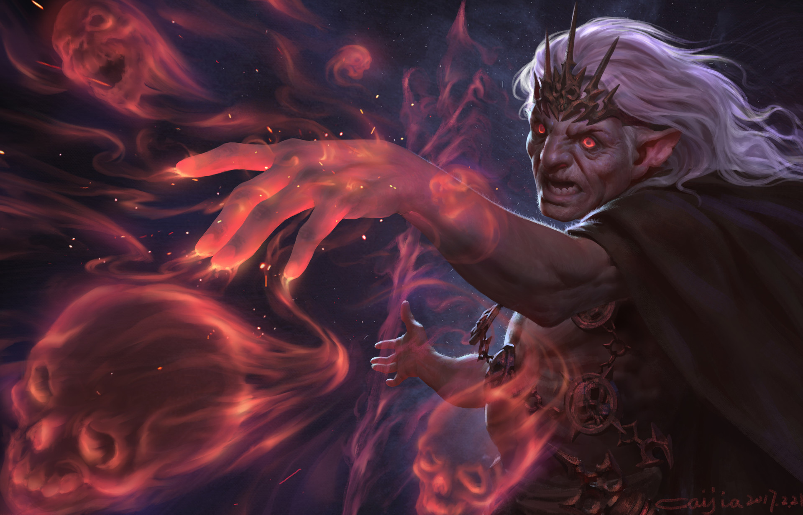

	
	

		
Чёрная магия

	

<a href="https://www.artstation.com/jiacai">Автор арта — Jia Cai</a>

<blockquote attention>
Базируется на причинении ущерба, увядании, смерти и прочих злодействах магическим путем.

**Самая легко поддающаяся изучению магия, однако опасная при самостоятельном обучении – чаще всего тёмных магов, практикующих руны данной ветви без присмотра наставника, находят мертвыми или обезумевшими.**
</blockquote>
<blockquote warning>
Простой люд опасается и всячески избегает чёрной магии и ее владельцев. В среде магов уважают некоторые возможные применения рун из данной ветви, но не без предрассудков.
</blockquote>

**Идеограмма Чёрной Магии** — является основой для любой другой руны данной ветви, усиливает и продлевает эффект только нижеследующих рун. 
  
В связке со знаками других школ действует иначе:
* Знаки ветви Белой магии – ослабляет эффективность воздействия на цель.
* Знаки ветви Влияния – придает рунам хаотичную нестабильность.
* Знаки ветви Созидания – вероятность критических эффектов стихий слегка увеличивается.
  
Основная идеограмма изучается только для того, чтобы создавать сложные заклинания - отдельно не используется.

**Идеограмма Смерти** — просто и банально, зато уважаемо уже много веков после Красного Рассвета – убить цель на месте. Руна сильно зависит от цели и профессионализма мага: молодой и здоровый человек станет плохо себя чувствовать. Старик отдаст богам душу сразу же.

**Руна Разрушения** — ржавчина, гниль, плесень, грибок, язвы, кариес – всё самое вкусное и другие медлительные деструктивные процессы. При регулярной практике ускоряется достижение окончательного эффекта.

**Руна Несчастья** — её опасаются новички, но нежно любят мастера Чёрной магии. Стоит вплести её в заклинание, как враг получит критический эффект. В одиночном варианте создает удручающую атмосферу вокруг цели: тускнеют краски, слышатся завывания, мелькают тени, учащаются мелкие неудачи. Убегая от маньяка, жертва обязательно споткнется.

**Руна Хаоса** — старший брат Руны Несчастья. Руна, которую все маги люто ненавидят, особенно если её использует противник. Она навязывает цели эффект первозданной случайности: будь то хаотичная траектория заклинания, случайный выбор цели или применение эффектов в непроизвольном порядке (включая самого колдующего). Если использовать на себя - мало не покажется.

**Идеограмма Слабости** — цель становится более уязвима к любого вида урону, жертве становится тяжело двигать собственными конечностями, ментальная слабость проявляется в неконтроллируемых эмоциях.

**Руна Тяжести** — обратное действие лёгкости: цель так сильно тянет к земле, словно к ногам привязаны гири, на шее висит камень, а в руках – полный бушель. В истории зафиксированы неоднократные случаи ломки костей при применении усиленного варианта.

**Руна Жёсткости** — цель или маг теряет всякую эластичность, подвижность отдельных составных частей, жидкости начинают вести себя как твёрдые тела и чем больше опыта — тем жесче. Человек под воздействием руны становится парализованным и в то же время более устойчивым к внешним (да и внутренним) повреждениям.

**Руна Ярости** — наделяет цель бесконтрольной жаждой крови. Адепты Чёрной магии предпочитают практиковаться в переполненных тавернах, однако на поле боя, чтобы посеять панику в рядах противника, эта руна тоже пригодится.

