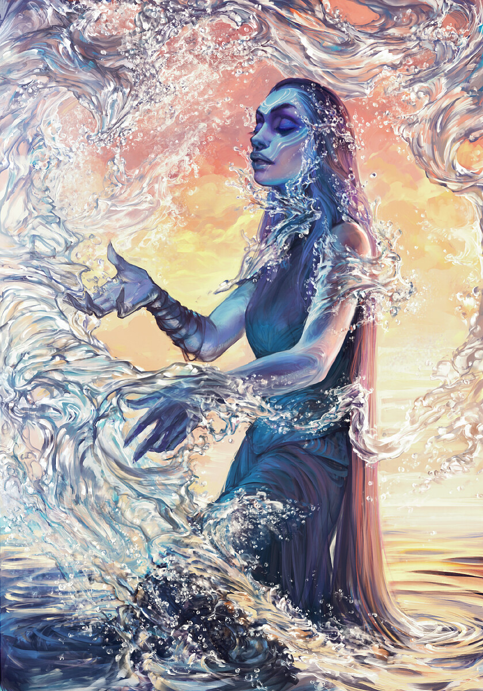

    
	
	

		
Магия Созидания

	

<a href="https://www.artstation.com/exellero">Автор арта — Exellero</a>

<blockquote attention>
В данной ветви изучаются и контролируются аспекты стихий: земли, огня, воздуха, воды, льда и молнии. Особенностью считается гибкая система рун, позволяющая создавать самые неожиданные комбинации вроде обжигающего льда, огненного ветра или страха и ужаса любого воина – молниевых брызг.

**Изучающие эту магию очень предсказуемы на поле боя и сильно зависят от окружения. Например, дождливая погода мешает заклинаниям огня, а засуха не даст нормально управлять водой.**

*Магия Созидания зависит от находящихся вокруг явлений природы, однако может и создать что-то с нуля, потребовав для этого двойной запас энергии мага.*
</blockquote>
<blockquote warning>

Исходя из того, что ветвь стихий самая популярная – конкуренция в мире среди этих магов высока, и большинство из них находят себя в рядах армии или же находят себя в бытовых профессиях.
</blockquote>

**Идеограмма Созидания** — является основой для любой другой руны данной ветви, усиливает и продлевает эффект только нижеследующих рун. 

В связке со знаками других школ действует иначе:
* Знаки ветви Белой магии – добавляет к действию согревающий или охлаждающий эффект.
* Знаки ветви магии Влияния – придает заклинаниям красивую визуализацию стихий.
* Знаки ветви Чёрной магии – добавляет всем рунам легкий стихийный урон.

Основная руна ветви изучается только для того, чтобы создавать сложные заклинания - отдельно не используется.

**Идеограмма Звука** – в самом простом ее виде: создает полную тишину или же сильно повышает громкость существующего звука. Также есть возможность влиять на тон. Действие магии распространяется в твёрдой, жидкой или газообразной среде. Используется как замена рупору или в случаях, когда утомляет шум с улицы или необходимо наложить на определенный участок защиту от лишних ушей. Некоторые ушлые чародеи используют для приглушения шагов.

**Руна Воздуха** — позволяет создавать потоки воздуха (управлять созданным нельзя, только создать вектор движения). Маги обычно используют эту руну, если столкновение в землей всем телом неизбежно — соломку не постелешь, зато о воздух затормозишь. Эта же руна, используемая должным образом, является руной охлаждения, в противовес руне огня.

**Руна Молнии** – руна, которую не используют без заземления. Применяется в основном против «консервных банок» с мечами и щитами или барахтающихся в луже пьянчуг.

**Идеограмма Пелены** — создаёт область из клубящегося абсолютно чёрного дымового, либо классического безвредного парового тумана: в нем ничего не видно, также сильно заглушены запахи и звуки. В дыму тяжело дышать, но какие-либо вредные газы, помимо обычного воздуха, отсутствуют.

**Руна Огня** – самая популярная руна, которую испробовали в десятках вариаций, начиная от искр для прикуривания папироски и заканчивая огненными шарами.

**Руна Воды** — дает власть над водой, туманом, а также позволяет конденсировать жидкость в любой емкости (включая стаканы и заканчивая глоткой недруга).

**Идеограмма Силы** — позволяет магу применить к цели импульс в одном конкретном направлении, не зависящем от его собственного расположения. Средний, умеренно опытный маг сможет опрокинуть плотный, набитый шкаф или отправить в голову вазу с пробитием черепа. В сложном заклинании, применив два или более действий в разные стороны, может разорвать цель на ошметки\щепки\осколки.

**Руна Земли** – управление горными породами, песком и глиной. Варианты использования заканчиваются в границах их естественного природного вида. С суррогатами и производными (стекло, слитки металла, ювелирные украшения) руна Земли не работает. Одиночная руна позволяет управлять и менять форму материала весом не более 300 кг, а его рыхление или уплотнение возможно в радиусе 10 м.

**Руна Льда** — острые ледяные шипы, полная заморозка цели, пара кубиков льда в крепкий коньяк.

