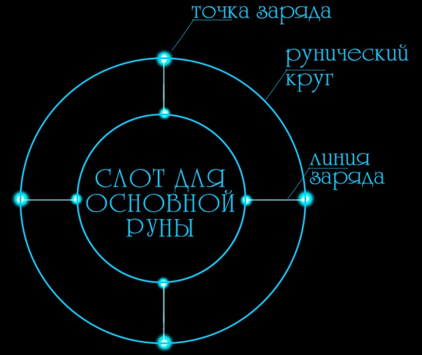
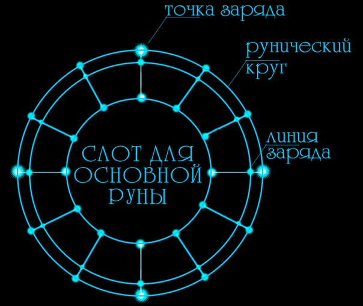
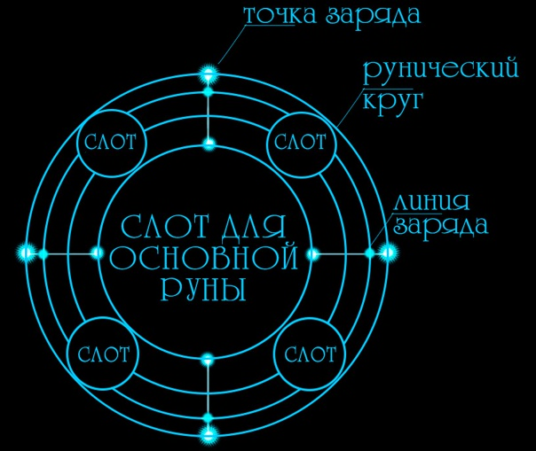
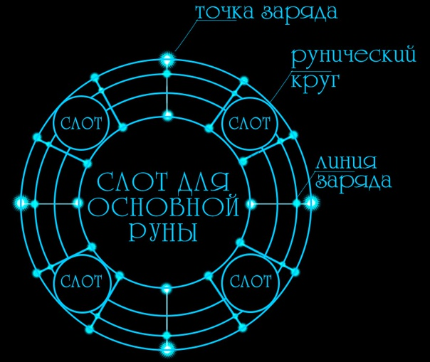
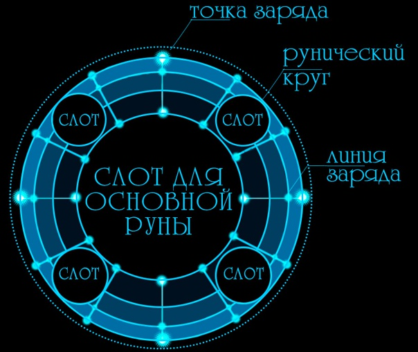

import ButtonCover from "~/components/controls/button-cover/button-cover";
import BlockquoteBox from "~/components/containers/blockquote-box/blockquote-box";
import CopyBox from "~/components/containers/copy-box/copy-box";

<ButtonCover src="pic.jpg" title="Артефакторика" author="Chris Waller" authorHref="https://www.chriswaller.com/" />
<BlockquoteBox attention>
**Артефакторика** (или артефактология) — сложнейшая из магических наук, изучающая, внезапно, артефакты и пути их использования. Преподаётся только в Ассоциации C’Итш’Тас. Тяжёлая и кропотливая работа на этом поприще сжирает почти всё свободное время, поэтому артефактологи зачастую ничего другого делать не умеют. Поскольку артефактолог — это обязательно маг, в местах распространённости магической науки артефакты найти гораздо проще и стоят они там дешевле.

**Артефакты** — это, по сути, заклинания, заключённые в предметы и ждущие активации.

**Артефактор** (Артефактолог) — это сильный маг, специализирующийся в одной или нескольких ветвях магии. Его артефакты, как и заклинания, будут привязаны строго к тем ветвям и рунам, которые он знает.
</BlockquoteBox>

## Изготовление артефактов
Основа артефактологического комплекса наук зиждется на двух дисциплинах — это сигилловедение и материаловедение. 
<BlockquoteBox attention text>
**Сигилловедение** — это по своей сути наука о том, как начертать руны на разных поверхностях так, чтобы не навредить себе и другим, а в лучшем случае принести пользу.

Эта дисциплина совмещает в себе специфику творческой работы художника и крепкость рук простого столяра или каменщика: каким инструментом какой материал обрабатывать и каковы особенности начертания конкретного символа? 

Ну и, естественно, зарядка магией некорректно начертанного артефакта может быстро отправить душу мастера в чертог. 
</BlockquoteBox>

1. Первым делом при создании артефакта мастер ознакомляется с материалом, по которому ему придется работать. 
2. После анализа свойств материала и его формы, мастер выбирает инструменты: для дерева это всевозможные резцы, для камня и металла в ход уже идут разные зубила и граверы, а также нередко и разные магические заклинания, которые каждый мастер разрабатывает для себя и своих учеников индивидуально.
3. Затем часто создается набросок. Резать вчистую ни один мастер не станет, тем более артефактолог, ошибка которого может стоить жизни.
4. Непосредственный процесс изготовления, нередко цикличный. Даже для мастера-артефактора не редкость создать артефакт только со второй или третьей попытки.
5. Испытание. Никто не станет продавать или использовать в бою неиспытанный артефакт: одно минимальное повреждение рисунка и эффект становится крайне непредсказуемым. На крупных артефакторных мануфактурах существуют целые команды по проверке и оценке артефактов.

## Промышленная артефакторика
С развитием магической науки и увеличением потребностей общества возникла необходимость в конвейерном производстве простых и не очень артефактов. 

Принципиальное отличие от ручной артефакторики заключается в доскональной разработке проекта артефакта: даже в случае с единичным индивидуальным заказом его можно будет с достаточной точностью повторить.

Фабрикация артефактов происходит в больших залах с постаментами, на которых работая по заранее сформированной заготовкой команда артефакторов при помощи уникальных заклинаний или специально созданных артефактов в эффективной манере наносится рунический рисунок.
<BlockquoteBox text>
В залах луатских артефакторий нередко можно увидеть **подвесной круговой балансир** — *подарок магам от технологических факторий*, представляющий собой рельсу, на которой пантографами или другими подвижными элементами закреплены вспомогательные артефакты: это могут быть усиливающие заклинания артефакторов пассивные артефакты, а также активные артефакты для общей обработки материала или точечного действия.
</BlockquoteBox>
<BlockquoteBox text>
В сикстинннской же традиции предпочитают использовать комплекс артефактов, поддерживающий форму изготавливаемого артефакта в подвешенном состоянии для удобной работы с любой стороны.
</BlockquoteBox>
<BlockquoteBox text>
При описании сложных механических устройств и комплексов механизмов среди инженеров часто используется слово "система". Среди колдунов и артефакторов для описания сложных артефактов и магических комплексов часто используется слово "конфигурация".

Пример — <a href="/menu/navigation/industry/herald/#%D0%BF%D1%80%D0%BE%D0%B4%D1%83%D0%BA%D1%86%D0%B8%D1%8F">конфигурации артефактории «Вестник»</a>
</BlockquoteBox>

## Схемы артефактов
Схемы артефактов могут быть самыми разнообразными. Выбор и процесс разработки рунической схемы зависит от нескольких сложностей встающих перед артефактором:
* Независимо от авторской магической интерпретации, заклинание не раскроет весь свой потенциал без необходимого количества <u>точек заряда</u>. 

Сложность в том, что повреждение точки заряда критично: оно может вызвать в лучшем случае перегрев и возгорание артефакта, но на деле свободная магическая энергия может повлечь практически к любым последствиям и абсолютно непредсказуема. Поэтому располагать точки заряда рекомендуется поодаль друг от друга и в наиболее защищенных местах формы.

* Энергия из точек заряда должна должным образом циркулировать по магическому рисунку, для чего и существуют <u>линии заряда</u>, наиболее распространённый вид которых — это <u>стандартные рунические круги</u>. Они работают эффективнее всего но подходят далеко не для каждой ситуации, формы и материала.

Линия заряда должна быть достаточно тонкой, чтобы удерживать в себе деликатную магическую энергию, но при этом достаточно широкой, чтобы пропустить пиковый магический поток артефакта. Также нельзя забывать про потери энергии на расстоянии, из-за чего массивные рунические рисунки часто становятся неэффективны.  

*Решение потерь на расстоянии — магистрали линий заряда. Магистрали представляют из себя множество (десятки штук) тончайших линий заряда.*

<BlockquoteBox text>
Точек заряда и линий заряда может быть сколько угодно, но чем уязвимее они расположены тем опаснее становится эксплуатация артефакта. 
</BlockquoteBox>

##### Опасности
Разрыв линии заряда менее критичен: в большинстве случаев он лишь ослабит артефакт. Исключение: избыток зарядных точек, в таком случае, при потере большого количества линий заряда, магическая энергия может освободиться.

Повреждение точек заряда же ведет к моментальным последствиям: накопившаяся в них энергия тут же освобождается. При повреждении незаряженной точки при последующей попытке использовать артефакт через точку будет происходить <u>утечка энергии</u> *всего артефакта*, что скажется на его эффективности и безопасности эксплуатации.

### Простой артефакт
*Простой рунический круг* — самый простой способ создания артефакта. Содержит только один символ с одним эффектом. После активации действуют не больше десяти секунд, затем требует подзарядки. Такие артефакты купить проще всего, чтобы козырнуть перед напарниками или противниками. Авторы таких артефактов часто халтурят, поэтому такие изделия чаще срабатывают не как надо: может случиться осечка, взрыв прямо в руке при активации или вообще бесконтрольное выкачивание энергии из мага в никуда.

### Простой пассивный артефакт
*Составной рунический круг* — способ создания артефакта с пассивным постоянным действием. Эффект слабый, однако не требует подзарядки и длится, пока у артефакта не выйдет срок годности. Существенный плюс — постоянное время действия. Минусы — артефакт нельзя «выключить». Обычно в два раза дороже артефактов с простым руническим кругом.

### Сложный активный артефакт
*Двухлинейный рунический круг* — сложные артефакты с сильным эффектом. После активации действуют ограниченное время, обусловленное длительностью вложенного заклинания (высчитывается по формуле из раздела о магии). После использования требуется зарядка. Встречаются реже. Их создание обходится более серьёзными затратами энергии и кропотливым трудом, а потому и стоят они дороже предыдущих. Количество «паленых» среди них несравнимо ниже ввиду того, что некачественный артефакт уже принесет проблемы своему автору в процессе создания.

### Сложный пассивный артефакт
*Составной двухлинейный рунический круг* — сложные артефакты с длительным действием (до нескольких часов, которые можно использовать порционно) или с возможностью многоразового использования (не более трёх раз до полной разрядки). Требуют подзарядки. Изготавливаются только под заказ за крупную сумму. Позволить себе такое могут только обеспеченные люди, месячный доход которых превышает 50 золотых.

### Легендарный артефакт

*Трехлинейный рунический круг* — легендарные артефакты. В отличие от других артефактов, обладают сильнейшим эффектом, продолжительным временем действия (почти сутки) и способностью самостоятельно заряжаться из окружающей среды (в Местах Силы самоподзарядка проходит в два раза быстрее). Таких за всю историю известно всего несколько, за последнюю историю — ноль. Самый знаменитый истрический пример — Думанский мост в Гуране, построенный с помощью артефакта: содержащееся в нём сложное комбинированное заклинание позволило в течение нескольких минут построить гигантский мост почти из ничего. Вещественных доказательств этого события нет, но литературные источники довольно авторитетные.

### Активный комплекс артефактов
*Комплекс рунических кругов* — способ множества магов применить силы в создании одного сильного артефакта. Применяется единожды, производит сильный эффект, а затем требует длительной зарядки — иногда до нескольких дней. Такие магические комплексы требуют постоянного обслуживания, желательно того же количества магов, что его создали. 

Пример комплекса артефактов — система междугородних порталов Сикстинны, представляющих из себя площади со множеством врезанных в камне взаимосвязанных рунических кругов и обслуживаемых бригадами артефакторов.

### Пассивный комплекс артефактов

*Комплекс составных рунических кругов* – подобен активному комплексу, но гораздо более сложен, действует на протяжении времени, обусловленного его схемой. Еще дольше заряжается и еще более труден в обслуживании. 

Пример: обсерватория магии в Луате, руны Истока в которой отслеживают вспышки магической энергии и места силы на огромной части Восточного континента.
