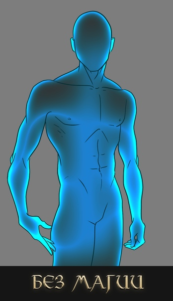
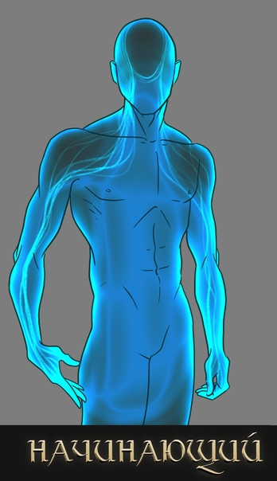
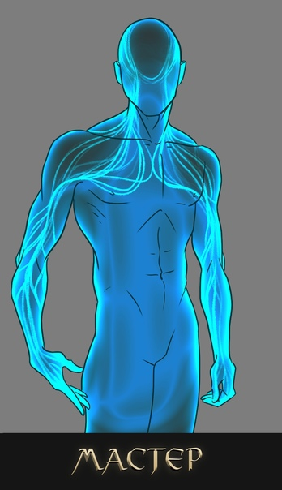
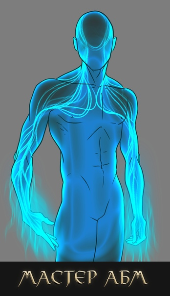

import ButtonCover from "~/components/controls/button-cover/button-cover";
import BlockquoteBox from "~/components/containers/blockquote-box/blockquote-box";
import CopyBox from "~/components/containers/copy-box/copy-box";
import Board from "~/components/containers/board/board";

<ButtonCover src="pic.jpg" title="Теория Магии" author="Dominik Mayer" authorHref="https://www.artstation.com/dtmayer" />
<BlockquoteBox attention center>
    Маг — это контроль, концентрация и точность.
</BlockquoteBox>
<BlockquoteBox attention text>
    В этой статье мы разберём основные вопросы и механики магии:
    * Почему магия?
    * Почему маги — маги?
    * Почему кто-то — не маги?
    * Как магия появляется, накапливается и куда девается?
    * Как маг находит в себе потоки магии и как учится ими управлять?
    * Чем можно чертить руны?
    * Руны можно не только чертить?
    * Чем отличается начинающий маг от мастера и дальше?
    * Что такое схема заклинания, энергия, трактовка рун, дальность и время действия?
</BlockquoteBox>

## Магия
Изначально магия появилась после Красного Рассвета. Корректно выражаясь, пользоваться ею смогли только после него, когда был разрушен первый Чертог, в котором и хранилась ценная энергия мира. Сама по себе магия с сотворения мира содержалась в некоторых представителях флоры и фауны в мизерных количествах. Некоторая её разновидность − некроэнергия − более живуча, и существовала в арсенале некромантов Нихерии задолго до текущих событий и даже прошлых.

Магия представляет собой концентрат особой энергии, накапливаемый на протяжении жизни смертными и сдаваемый после смерти. Можно провести аналогию с плодом, у которого назревает мякоть, дающая семечку повторить цикл жизни.

Лишь благодаря рунам, которые попали в руки дворфов и всех остальных, смертные научились манипулировать этой энергией: разлитой в окружающем мире и содержащейся в них самих.

Великий Исход магию забрал, а она снова вернулась — с окончанием Индикта Мертворожденных, — но странная, вся на себя не похожая. Пришлось работать с тем, что имеем.

## Маги
Как известно из истории, первой расой стали бестийцы. Боги создали их на совесть. Структура души бестийцев крайне прочна и самодостаточна, а потому не заместила отсутствующее в себе магией. В отличие от остальных рас, чья сущность уже не идеальна (что сказывается даже на сроке жизни и том, что магия меняет их внешне как ребёнок − глину).

Таким образом мы пришли к тому, что маги − условно дефектные представители населения Нихерии, но не по своей воле.

Исходя из статистики прошлого, где 80% рождались со склонностью к магии, стоит подчеркнуть, что это был печальный показатель. Лишь 20% населения мира (в том числе бестийцы) обладает цельной структурой души, т.е., не обладают даром к магии. Сегодня же всё не так плохо, как может показаться. Всё намного. Намного хуже.

В Уходящей Эпохе 90% населения мира рождаются без ограничителя на склонность к магии, 40% бестийских метисов рождаются со слабыми ее проявлениями, а половина всего магически-одаренного населения страдают от расстройств души самого разного толка.

## Явление, накопление, девание
Мы уже рассказали, что магия − это продукт обработки душ умерших. Также это сами развоплощённые души, которые по оценке богов уже неспособны выполнять свою основную функцию - накапливать и вовремя отдавать.

Красный Рассвет разрушил находящийся в Нихерии Чертог, создав самую чудовищную утечку энергии в истории. И наши дефектные смертные тут же начали впитывать это в себя как губки, но ещё не владея секретами рун.

Накопление длится до тех пор, пока душа не заполнит в себе все пустоты. Поэтому у магов существует такое понятие как лимит энергии на заклинания. Трата лимита провоцирует повторное накопление до необходимой черты. Свыше возможного в тело не запихнуть энергию, как ни старайся.

Потратить магию можно только на заклинания через руны, либо разбазарить её в такие предметы как осколки с'итш, Немощи, либо невольно накормить ею мороков.

## Потоки
Потоки маг учится в первую очередь **чувствовать**. Они как ток крови, пульсируют внутри, двигаются, являются чужеродным дополнением, пусть и родственным душе по своей природе. Согласитесь, не очень приятно осознавать, что магия − некий паштет из чужих душ?

Маг нащупывает ток энергии и начинает контролировать его. Как только поток пойман, наступает период его привязки. Самым простым и близким для этого являются руки мага.
Управление потоком идёт от головы, как и трактовка рун после всего этого. Расположение потоков можно увидеть на предоставленных ниже изображениях.

## Знаки
Черчение рун и идеограмм пальцами спровоцировано привязкой потока к рукам. Именно там магическая энергия может найти выход во внешний мир. Наличие перчаток не особо мешает процессу, так как маг уже натренирован создавать заклинания именно таким способом.

Предметом, например, палочкой, очень трудно рисовать и самостоятельно этому не научиться, как ни бейся. Потому что поток не привязан к палочке (и его невозможно к ней привязать, потому что палочка не часть тела мага).

Рисунок руны появляется в миллиметрах от кожи, как если бы палец обмакнули в обычную краску. Руна никогда сама собой не вылетает из ладони, четкая и готовая сразу к действию. Её нужно рисовать, ровно, осторожно и кропотливо, вплетая её в схему заклинания.

## Произношение
Язык с'итш — это прежде всего язык. Маги Эпохи Разума на нём писали без конца, но могли ли они предполагать, что боги болтают на языке с'итш без умолку? Никто не знает, кто создал фонограмму — намеренно или волей судьбы, эти люди остались неизвестны. Но благодаря им мы теперь знаем — с'итш омерзителен и даже самым отпетым любителям гротеска режет слух.

<BlockquoteBox mystery>
    В гУЭ в Сикстиннской академии магии впервые смогли расшифровать и *исполнить* руну Белой Магии, используя небольшой *оркестр* мастеров магии. Остальные руны доселе остаются неизвестны.
</BlockquoteBox>

## Ранг

<Board gap="20px">

    #### Без магии
    Вы видите перед собой обычного представителя Нихерии, абсолютно здорового, физически и духовно.

    В нём нет никаких дефектов и в частности дара магии, он проживёт до глубокой старости, если не будет делать глупости.

    В его теле есть душа, которая накапливает знания и опыт. Так задумано Близнецами, и так правильно.

</Board>

<Board gap="20px">

    #### А это начинающий маг
    Он уже ощутил в себе поток и, согласно рекомендациям многих магов до него, привязал поток к рукам, чтобы чертить кончиками пальцев схемы заклинаний.

    В его голове поток соединяется, чтобы трактовка рун из головы конкретного мага работала.

    Потоки магии и душа вместе выглядят как-то не так, потому что начинающий маг − представитель дефектной части населения Нихерии. Ему подвластна материя, жизнь и смерть, а также магия корёжит его тело как хочет и демонстрирует несовершенность.

</Board>

<Board gap="20px">

    #### Мастер
    У мастера потоки разрослись, окрепли. Они как вторые мышцы, натренированные сотнями заклинаний и магических практик по развитию резерва и лимита. Потрёпанные долгими накоплениями и тратами энергии, эти потоки вынуждены укореняться в теле и душе мага. Влияние магии на тело такое же суровое, и никуда от него не деться.

    Обратите внимание, что соединение потока в голове не изменилось. Это потому, что мастер-маг от начинающего отличается по большей части только границами своего лимита.

</Board>

<Board gap="20px">

    #### Адепт Боевой Магии
    Специалист боевой магии выглядит ещё круче, чем обычный мастер-маг.

    Его магические потоки, заблаговременно привязанные к рукам, распространяются за границы тела, ведь боевых магов специально обучают выталкивать магию из себя. Это помогает им накинуть поток дальше кончиков пальцев. Например, на меч, который они держат в руках.

    **Вот и весь секрет того, почему только боевые маги могут чертить руны чужеродными предметами: *они натягивают свои потоки на оружие как сову на глобус.***

    Кроме этой хитрости, у боевых магов есть солидная прибавка к мощности заклинаний: из-за того, что их поток энергии вылазит за границы, они постоянно облепляются магией из окружающего мира, как липучка − мухами. И это дополнение уходит в заклинание в виде повышенной мощности.

</Board>

## Схема, энергия, трактовка
**Схема заклинания** − это фильтр, через который проходит магическая энергия мага. Через схему энергия конвертируется и приобретает физическое воплощение, смысл, задаваемый выбранными рунами по трактовкам, которые выучил маг.

Весь контроль мага над заклинанием заканчивается, когда он закончил чертить схему и создал заклинание.

Невозможно разделить уже созданное заклинание на составляющие, так как это уже конверсированная энергия.

Неверный рисунок руны нарушает принцип конверсии, приводя к негативным последствиям и деструктивным воспроизводствам магии.

**Дальность** и **время действия** − одно из самых специфических явлений магии.

Заклинание, даже оформленное, всё ещё является энергией, а её всё вокруг стремится забрать себе. И единственное отличие в том, что на это придется потратить какое-то усилие.

Заклинание ценится только за счёт того времени, пока оно существует и работает; и радиуса, в котором проявляется его эффект. Затем оно не исчезает в никуда, а распадается на то, чем было изначально − энергию. И тут мы возвращаемся к вопросу накопления магии: в тело мага эта энергия вернётся, но не сразу. Речь о круговороте магии в природе, а не чудесном мгновенном впитывании энергии обратно.

Эту энергию как канат бесконечно перетягивает мир и маги без перевеса в чью-либо сторону.
