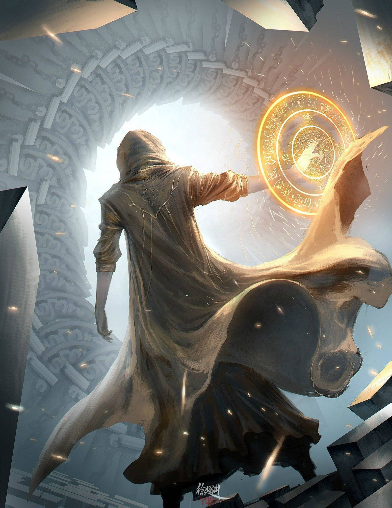

	
	

		
Белая магия

	

<blockquote attention>
Используется для временных усиливающих эффектов, исцеления, и воскрешения. Труднее всего поддается изучению, однако находится в доступе любого, кто обладает магическим даром, не боится вида крови и трудолюбив.

Преподается практически везде, так же можно найти наставника в любом крупном городе.

Обычно маги этой ветви выступают как поддержка на поле боя, работники лазарета, личные целители в богатых семьях или продают свои услуги как наёмные чародеи.
</blockquote>
<blockquote warning>
Для того, чтобы эффективно использовать Белую магию, особенно её руны исцеления, необходимо знать медицину и анатомию, а также, опционально, алхимию, травничество. Ни один целитель не проведет полного восстановления пациента, не имея навыков в перечисленных направлениях.

Немаловажный аспект - ресурсы на исцеление черпаются из организма цели. Именно поэтому Белая магия работает только с живыми (или только что умершими), а применение рун провоцирует истощение и слабость.

Магия не работает на флору. Для этого есть друидизм.
</blockquote>

**Идеограмма Белой Магии** — является основой для любой другой руны ветви Белой магии, усиливает эффект и длительность только нижеследующих рун.

В связке со знаками других школ действует иначе:
* Знаки ветви Влияния – облегчает регенерацию энергии мага, позволяя эффективнее плести заклинания.
* Знаки ветви Чёрной магии – ослабляет действие Чёрной магии на цель.
* Знаки ветви магии Мира – предохраняет колдующего от побочных эффектов стихий.
  
Основная идеограмма изучается только для того, чтобы создавать сложные заклинания - отдельно бесполезна.

**Идеограмма Жизни** — позволяет воскресить недавно умершего (не более двадцати минут назад). Рекомендуется использовать над целым телом, приготовившись залечить все препятствующие жизни травмы, и пока не началось разложение. Расчлененное тело вернуть к жизни не получится. После воскрешения требуется **длительный период восстановления** (от двух недель до месяца, за время которых герой будет слаб, вял и с трудом приходить в норму взрослого, здорового человека).

**Руна Воли** — даёт волю к жизни на последнем издыхании, насыщает цель или мага жизненной силой, ценой собственного запаса волевых сил. Не рекомендуется практиковать, самому находясь в депрессии.

**Руна Исцеления** — заживляет раны легкой, средней и тяжелой степени (зависит от навыка). Яды, болезни и проклятия в эту категорию не входят. Перед использованием рану очищают и изымают из неё инородные объекты.

**Руна Выносливости** — повышает физическую выносливость цели или мага. В приоритете для воинов в тяжелых доспехах, с двуручным оружием или при марш-бросках на дальние расстояния. После использования цель испытывает усталость в двое сильнее обычной.

**Идеограмма Крепости** — наделяет мага или его цель физической силой, достаточной, чтобы в руках можно было раскрошить камень. Предупреждение: наделяет силой, но не крепостью костей.

**Руна Легкости** — она же левитация. Не уменьшает массу, но уменьшает вес, поднимая в воздух с помощью магической силы (максимум 100 кг для одиночной руны). Контролировать парение невозможно — ближайшие предметы, плоскости и противодействующие силы в помощь.

**Руна Гибкости** — наделяет цель или мага повышенной гибкостью, из-за чего раньше несгибающиеся суставы спокойно дадут сделать шпагат даже на двух катящихся рядом телегах.

**Руна Покоя** — наделяет цель бесконтрольным умиротворением. В полевой медицине не уменьшает страдания раненого, но предотвращает излишние спазмы и конвульсии, облегчая работу медику.

